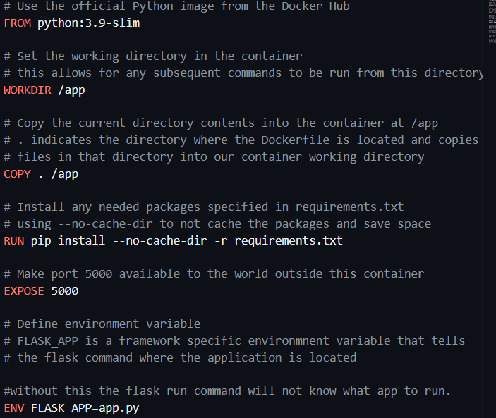
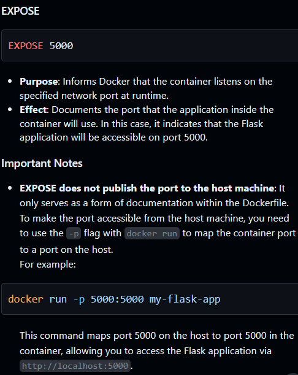

# container_demo

This demo details how to utilize docker and the concepts of containerization to make applications portable. This specific example pertains to a very simple, "hello world", flask application.

Python can be challenging to make portable because of the need to make available many dependencies and language interpreters at runtime. Containerization is a concept which seeks to address these issues.

You can see the extent of this applicaiton in app.py but this exact repository would work for a much more complex app.py complete with any other framework files. 

The core concept here is the use of a Dockerfile to provide instructions for docker to build a container that will house your application:

The commented portions of this code attempt to explain the basis of what this file does. This is very much boilerplate code for a flask application and many others. 

Some key concepts are the base image (indicated in the FROM line) which can be changed based on your needs. Here this is a python 3.9 base image with -slim indicating that it has been optimized to be lightweight. There are a lot of base images you can use.

The other point that is more difficult to understand is the EXPOSE line:

essentially, the container needs to have a port allocated so that entities outside the container can interact with the application inside the container.

I have included many of the popular docker commands in the Makefile so you can see what they do and have them on hand as you develop.

The key workflow here is:

> Write/Change Code -> Test locally with '$flask run' -> build an image for updated code -> run the image to ensure the container works

Once your updated container is running, you can be confident that the image you push to the repository is stable. The workflow yml takes care of pushing automatically to dockerhub but there is a make command for that as well so you can understand how it works. Be sure to login to docker using an access token you create on your account to make this work. I have this in a .env file as well as in my github secrets so they can be made available to the workflow runner during the build. 

After you have pushed to docker hub you can always pull an image from dockerhub:

> docker pull docker_username/repo_name:image_tag

As a test, you can deactivate your venv which has flask downloaded in it and then pull your image and run it, you can see that it runs invariant of the state of your local machine.

Now you know you have a working, portable application, that runs anywhere docker is available! This is a cornerstone for python deployment.